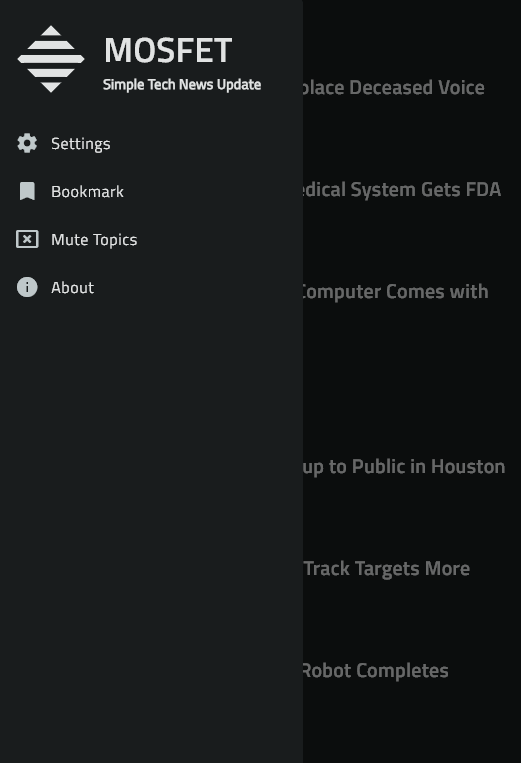
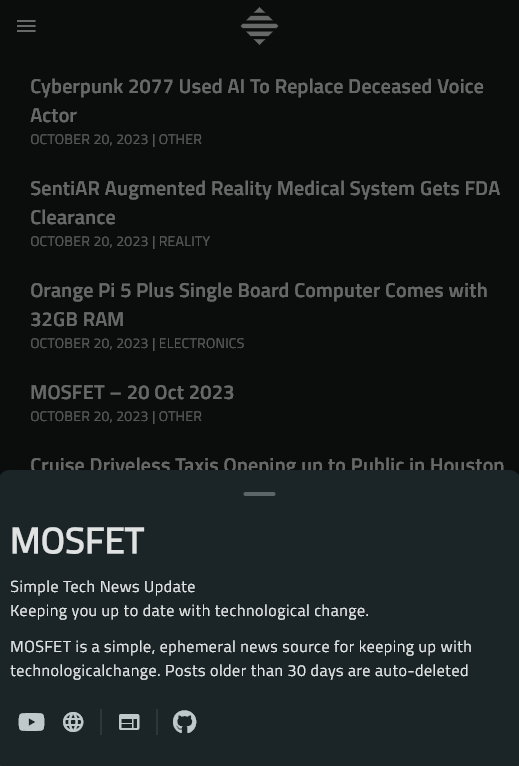

<div align="center">
    
    <h1>MOSFET</h1>
    <p>A cross-platform application for the [mosfet.net](https://mosfet.net) website written in Flutter</p>
</div>

---

<p align="center">
  
  
  
</p>


## Futures
- Save posts as bookmarks
- Mute certain topics
- Able to load previous posts offline
- Download images
- Copy or launch URLs

## Installations
- [Android]()
- [Windows]()

## Create
First clone the project
```powershell
git clone 'https://github.com/empitrix.com/mosfet_app'
cd ./mosfet_app
flutter create .
```

## Todo
- [ ] Add a color filter like the website
- [ ] Use [feeds](https://mosfet.net/feed) to make APIs
- [ ] Refactor the code base

## Acknowledgments
- [**MOSFET**](https://mosfet.net): The Mosfet main website
- [**MOSFET (youtube)**](https://youu): The Mosfet YouTube channel
- [**N-O-D-E**](https://n-o-d-e.net/): The first place that I hear about Mosfet

